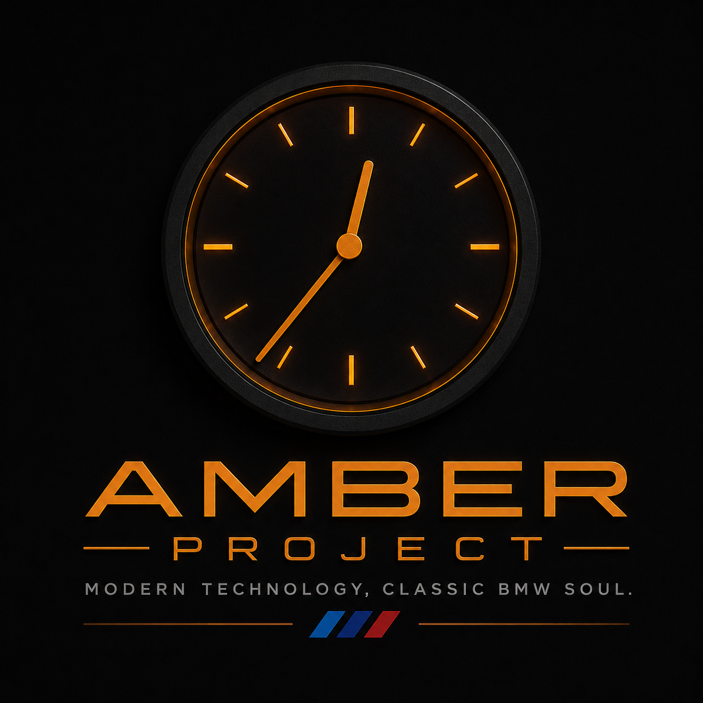

# 🟠 Amber Project

# Modern Technology. Classic BMW Soul.

*"Not to replace the classics, but to continue their story."*

---

**Time starts at 00:36.**

---

## The Story

Amber Project began with a simple idea.

A small anniversary gift for a BMW that has been part of its owner's life for more than fourteen years.

Not another screen.

Not another gadget.

Not another aftermarket accessory.

Something that could have existed if BMW engineers in the late 1990s had access to today's technology.

From that moment, the project became something much larger than a digital clock.

It became a philosophy.

---

## Our Mission

Amber Project is an open-source platform for creating OEM-inspired hardware and software for classic BMW vehicles.

Every module is designed with one goal:

> Build what BMW might have built.

No compromises.

No unnecessary complexity.

No permanent modifications.

Just thoughtful engineering.

---

## Amber Project Principles

### 🟠 OEM First

If it looks aftermarket,

redesign it.

---

### 🟠 Fully Reversible

Nothing should permanently modify the vehicle.

Every installation should be reversible.

---

### 🟠 Respect the Original

Technology should complement the car,

never replace its character.

---

### 🟠 Modular

Every feature should stand on its own.

Future ideas should plug in naturally.

---

### 🟠 Offline First

Core functionality must never depend on cloud services.

The car should always work.

---

### 🟠 Open Source

Knowledge grows when it is shared.

Every important decision should be documented.

---

### 🟠 Quality Over Quantity

One beautifully implemented feature

is worth more than twenty unfinished ones.

---

## Technology

### Firmware

- ESP32
- PlatformIO
- LVGL
- BLE

### Android

- Kotlin
- Android Studio
- BLE
- Yandex Maps integration

### Hardware

- ESP32-2424S012C-I
- Capacitive Touch
- Round IPS Display
- Battery Powered

---

## Roadmap

- [ ] BMW-inspired analog clock
- [ ] BLE communication
- [ ] Android Companion App
- [ ] Gate opener
- [ ] Smart notifications
- [ ] Vehicle sensors
- [ ] OTA firmware updates

---

## Philosophy

Amber Project is not about modernizing a classic BMW.

It is about preserving everything that made these cars special while carefully adding features that feel completely natural.

Every screen.

Every animation.

Every sound.

Every interaction.

Should feel like it belongs.

---

## The Team

**David**

Project Creator

Hardware

Electronics

Vision

---

**ChatGPT**

Architecture

Firmware Design

Android Architecture

Documentation

---

**GitHub Copilot**

Implementation

Refactoring

Testing

---

## Contributing

Contributions are welcome.

Before implementing a feature, ask yourself one simple question:

> **Would a BMW engineer from 1998 smile if they saw this in 2026?**

If the answer is yes,

you're probably on the right path.

---

## 🟠 Ignition ON.

### Time starts at **00:36**

