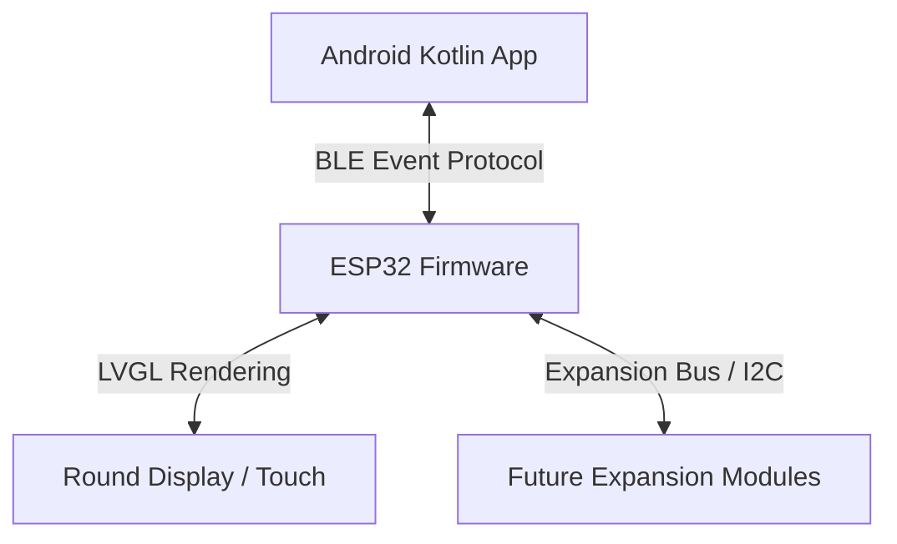

# 🟠 Amber Project - High-Level Architecture

## Overview

The Amber Project is split into modular components that interact via standardized protocols. This ensures that any piece can be upgraded or replaced without compromising the rest of the ecosystem.

---

## 1. ESP32 Firmware

The core brain of the physical module is an ESP32 microcontroller, managed using the **PlatformIO** developer ecosystem.

* **Core Responsibilities:**
  * Real-time multitasking, display orchestration, and Bluetooth state management.
  * Time calculation and synchronization via internal clock routines or RTC.
* **Graphic Stack:**
  * **LVGL (Light and Versatile Graphics Library)** is utilized to build robust, highly customized UI elements resembling period-correct BMW panels.
  * Direct rendering to round and rectangle screen targets avoiding flashy modern shaders in favor of clean pixel layouts.

---

## 2. LVGL (Light and Versatile Graphics Library)

* Customized skin structures configured matching BMW orange and amber instrument styles.
* Layout elements restricted to classic geometry and flat forms.
* Optimized frame-rates to guarantee seamless touch-to-visual response.

---

## 3. BLE (Bluetooth Low Energy)

The bridge between mobile platforms and the in-car hardware.
* Uses an event-driven GATT setup.
* Uses minimal data structures to avoid battery drain and delays.
* Decoupled design allows the hardware module to stay offline and work entirely without any phone connected.

---

## 4. Android Kotlin Application

A companion mobile app acting as an interface configuration utility and routing telemetry proxy.
* **Architecture:** Modern Android MVVM pattern written entirely in Kotlin.
* **Key Components:**
  * **BLE Communication Service:** Operates robustly in the background, forwarding events (e.g. media changes, phone statuses, and navigation steps).
  * **Yandex Maps Integration:** Integrates into navigation platforms to pull classic directional cues and route guidance.
  * **Car Launcher Mode:** An alternative retro-styled UI dashboard interface designed specifically for center console mounted tablets or screens.

---

## 5. Future Expansion Modules

To maintain the **Modular** principle, the hardware design leaves interface buses (such as I2C, SPI, or UART) accessible.
* **Vehicle Diagnostic Module:** Interface boards for reading K-Line/I-Bus data lines without permanent wire splicing.
* **Auxiliary Sensor Unit:** External oil pressure, coolant, and intake temperature sensor hub.
